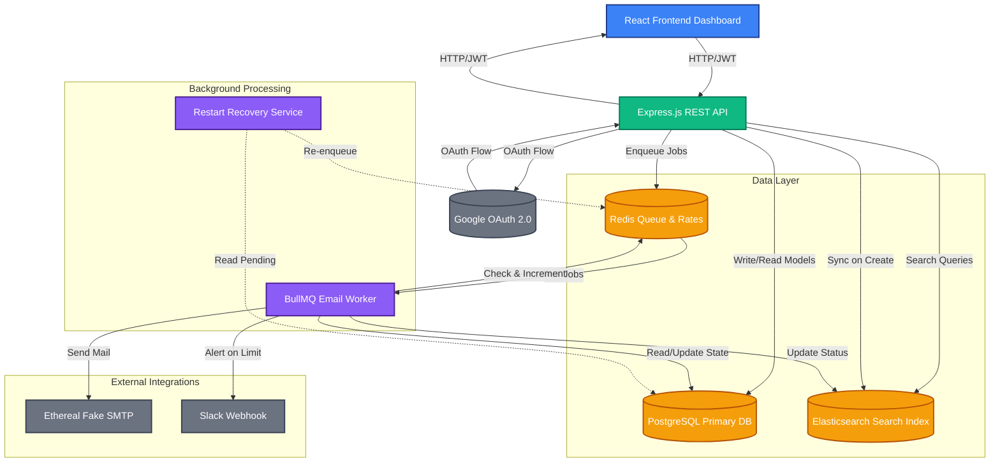
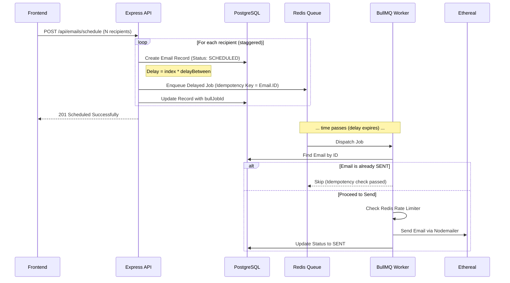
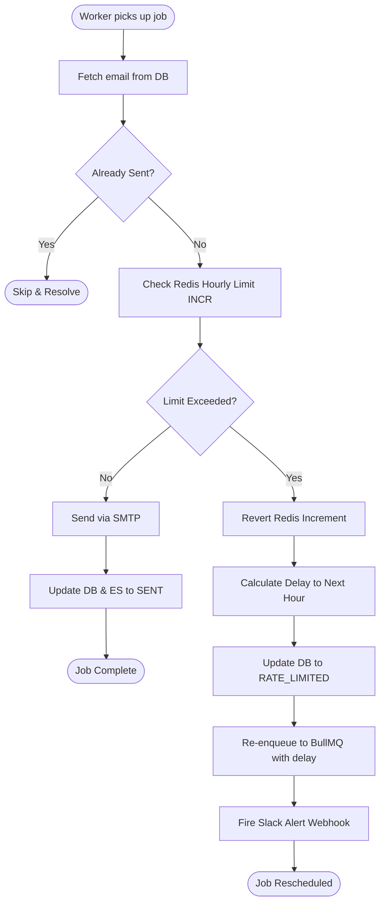

# System Architecture: ReachInbox Email Scheduler

This document outlines the architectural decisions, component interactions, and data flow of the ReachInbox Email Scheduling system, built for the Outbox Labs hiring assignment.

---

## 1. High-Level Architecture

The system is built as a monolithic Node.js backend utilizing decoupled asynchronous workers for heavy lifting. It relies on a robust combination of PostgreSQL for persistent truth, Redis for fast queuing and rate limiting, and Elasticsearch for optimized full-text querying.



---

## 2. Core Workflows & Data Flow

### A. Bulk Email Scheduling Flow

When a user submits a payload with thousands of recipient emails, the system guarantees efficient ingestion without hitting immediate limits.



### B. Rate Limiting & Rescheduling Flow

The system protects upstream SMTP servers using a Redis-backed sliding/fixed window rate limiter.



---

## 3. Key Design Decisions

### 1. Separation of Concerns (Queues vs. Database)
- **PostgreSQL** acts as the definitive source of truth for the state of an email (`SCHEDULED`, `RATE_LIMITED`, `SENT`, `FAILED`).
- **Redis (BullMQ)** is treated strictly as an ephemeral state machine. If Redis crashes and data is lost, the system can reconstruct the queue entirely from PostgreSQL.

### 2. Idempotency Guarantee
When `POST /api/emails/schedule` is hit, it generates an email record in Postgres. The resulting Database `id` is passed to BullMQ as the `jobId` parameter. BullMQ natively ignores jobs pushed with an identical `jobId`. Additionally, the worker explicitly checks the database before sending to guarantee the email hasn't already been dispatched.

### 3. Graceful Staggering & Throttling
- **Controller-Level Staggering:** Bulk schedules are natively staggered at the time of insertion by multiplying the user's `delayBetween` configuration by the array index.
- **Worker-Level Throttling:** BullMQ is configured with a `limiter` option on the worker, hard-capping the speed at which a single node can pull jobs, completely independent of the scheduled timestamps.

### 4. Elasticsearch for Real-Time UI
Instead of complex `ILIKE` queries in PostgreSQL that degrade under load, all email records are double-written to Elasticsearch. The Dashboard search bar directly interfaces with an ES `multi_match` query, ensuring sub-millisecond lookups across `subject`, `body`, and `to` fields regardless of scale.

### 5. Restart Recovery Protocol
A standalone script (`src/services/restartRecovery.ts`) fires on server boot. It queries PostgreSQL for any email that should be in the queue (`status: SCHEDULED` or `RATE_LIMITED`) and verifies its existence in Redis. If the job was lost due to a crash, it is instantly reconstructed and re-enqueued.

---

## 4. Database Schema

The minimal required schema to support the above operations:

```prisma
model User {
  id        String   @id @default(uuid())
  googleId  String   @unique
  email     String   @unique
  name      String?
  avatar    String?
  emails    Email[]
  createdAt DateTime @default(now())
}

model Email {
  id           String    @id @default(uuid())
  userId       String
  user         User      @relation(fields: [userId], references: [id])
  to           String
  subject      String
  body         String
  senderEmail  String
  status       String    @default("SCHEDULED") // SCHEDULED, QUEUED, RATE_LIMITED, SENDING, SENT, FAILED
  scheduledAt  DateTime
  sentAt       DateTime?
  errorMessage String?
  bullJobId    String?   // Links DB to Redis
  createdAt    DateTime  @default(now())
  updatedAt    DateTime  @updatedAt
}
```
